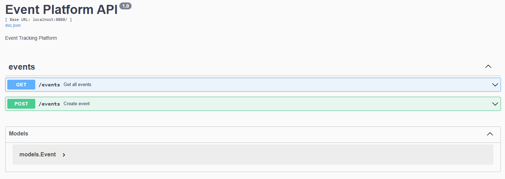
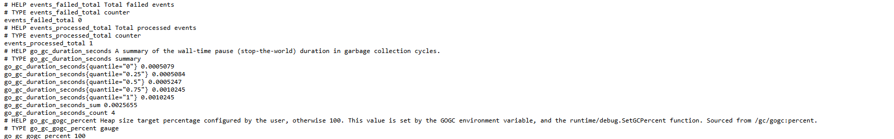
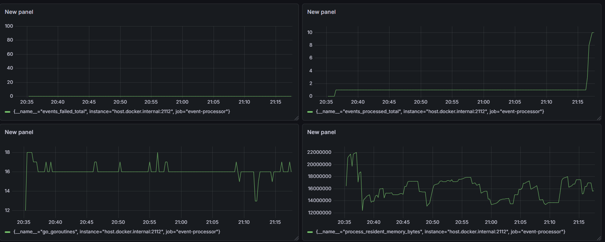

# Event Tracking Platform

Сервис для сбора и обработки пользовательских событий.

## Стек

* Go
* PostgreSQL
* Kafka
* Docker
* Prometheus
* Grafana
* Swagger

## Архитектура

Client
↓
REST API
↓
Kafka Producer
↓
Kafka
↓
Processor Consumer
↓
PostgreSQL

Prometheus ← Processor
↓
Grafana

API принимает события от клиентов и публикует их в Kafka.

Processor читает сообщения из Kafka и сохраняет их в PostgreSQL.

Prometheus собирает метрики приложения.

Grafana визуализирует метрики.

## Запуск

```bash
docker compose up -d
```

Запуск API:

```bash
go run cmd/api/main.go
```

Запуск Processor:

```bash
go run cmd/processor/main.go
```

## Swagger

http://localhost:8080/swagger/index.html



## Метрики

http://localhost:2112/metrics



## Grafana

http://localhost:3000



## Основные возможности

* Создание событий через REST API
* Асинхронная обработка через Kafka
* Сохранение событий в PostgreSQL
* Мониторинг через Prometheus
* Дашборды Grafana
* Swagger документация
* Graceful Shutdown
* Unit Tests

```
```
